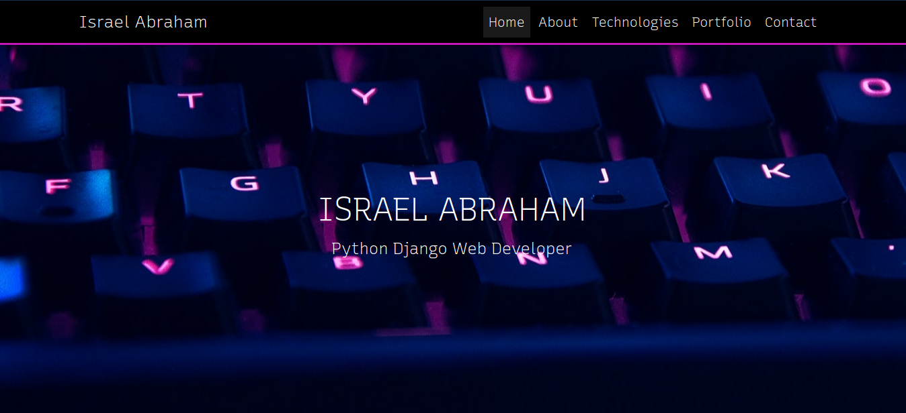

## #Portfolio App

This is a simple Portfolio app that I made for HNGi8 task 2

<br>
The interface is as shown:



<br>
To get it running on your local machine, follow the steps below:

1. Run the commands below in your terminal:

```
git clone https://github.com/israelvictory/HNGi8_Task2.git
```

2. change directory to diary:

```
cd HNGi8_Task2/hng
```

3. Install the requirements with the command below:

```
pip install -r requirements.txt
```

4. Run the development server with

```
python manage.py runserver
```

5. Launch your browser and navigate to:

```
http://127.0.0.1:8000
```
